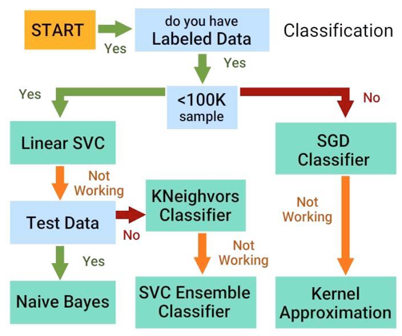

# Credit Risk Analysis

> Apply machine learning (Supervised Learning) to solve a real-world challenge: credit card risk that we've built and evaluate using Scikit-Learn.

Photo by <a href="https://unsplash.com/@averye457?utm_source=unsplash&amp;utm_medium=referral&amp;utm_content=creditCopyText">Avery Evans</a> on <a href="https://unsplash.com/s/photos/credit?utm_source=unsplash&amp;utm_medium=referral&amp;utm_content=creditCopyText">Unsplash</a>

## Overview

Building and evaluating several machine learning models in the branch of Supervised Learning to predict credit risk. Being able to predict credit risk with machine learning algorithms can help banks and financial institutions predict anomalies, reduce risk cases, monitor portfolios, and provide recommendations on what to do in cases of fraud.

Credit risk is an inherently unbalanced classification problem, as good loans easily outnumber risky loans. When using data from LendingClub; a peer-to-peer lending services company to apply we to employ different techniques to train and evaluate models with unbalanced classes ...

Preprocessing steps:

- Acquire the dataset, in this case text file [LoanStats_2019Q1.csv]()

Transformational steps:

- Identifying and handling the missing values (None)
- Encoding categorical variables with a mix of Pandas and Scikit Learn's 'LabelEncoder'

Splitting the data set:

- Feature scaling with StandardScaler
- Normalization

Implement machine learning models:

- Logistic Regression
- Decision Tree
- Random Forest
- Support Vector Machine
- Gradient Boosting for classification

Use re-sampling to attempt to address class imbalance:

- Combination Sampling with imblearn's SMOTEENN

Evaluate the performance of machine learning models:

- Model evaluation and the calculating with the confusion matrix.

You want to use pipelining with scikit learn from an API or flatfile. A pipeline is one object that does all of your preprocessing work (feature selection, imputation, etc.)

### Understanding Machine Learning

Machine Learning -> Supervised Learning -> Classification OR Regression:

- Classification predicts the CATEGORY that data belongs to.
- Regression predicts a NUMERICAL value based on previously observed data.

### Resources

- Software: Visual Studio Code, Jupyter Lab
- Languages: Python
- Libraries: numpy, pandas, matplotlib, seaborn, scikit-learn
- Data Sources:
  Loan Data: ../data/raw/LoanStats_2019Q1.csv

## Analysis

### Two evaluation methods: ensemble learning and re-sampling

Easy Ensemble AdaBoost Classifier performs the best with our steps & dataset; therefore, we would move forward with this estimator for further predictions.

The oversampling recall score (with SMOTE) has the highest score for predicting both low-risk and high risk loan statuses. We would put forward that this is the best model considering the financial cost risk associated with False Negatives.

### Naive Random Oversampler

### SMOTE

### Cluster Centroids

### SMOTEENN

### Balanced Random Forest Classifier

### Easy Ensemble AdaBoost Classifier

## Todo Checklist

A helpful checklist to gauge how your README is coming on what I would like to finish:

- [ ] Use Scikit Learn's Pipelines

## Contributing

Pull requests are welcome. For major changes, please open an issue first to discuss what you would like to change.

Please make sure to update tests as appropriate.

## License

[MIT](https://choosealicense.com/licenses/mit/)
